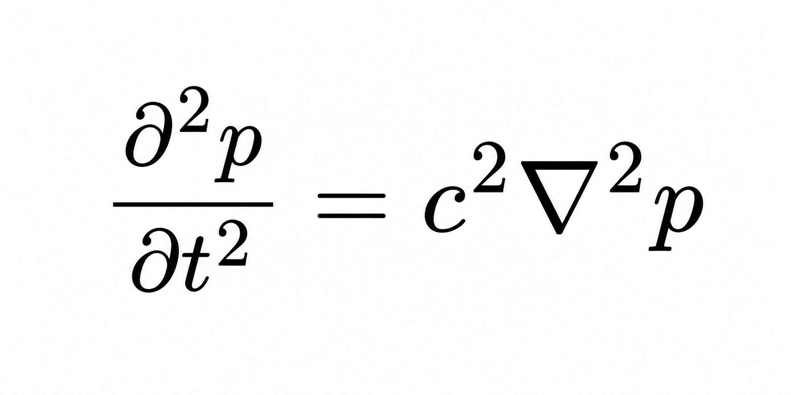

# Hybrid-FDTD-ML-Solver

Hybrid FDTD–machine learning framework for autoregressive acoustic wavefield prediction with GPU acceleration.

---

# Overview

This repository implements a hybrid finite-difference time-domain (FDTD) and convolutional neural network (CNN) framework for simulating and predicting three-dimensional acoustic wave propagation inside a rigid cubic domain.

The physical model solves the linear acoustic wave equation for pressure-field evolution inside a rigid cubic domain of size 0.5 m × 0.5 m × 0.5 m with Neumann boundary conditions. The speed of sound is set to 343 m/s. An enhanced Ricker wavelet source is used together with an initial Gaussian pressure bump to generate stronger early-stage wave amplitudes and improve temporal learning behavior.

The framework consists of four major stages:

## 1.Pure FDTD Simulation
A full 3D FDTD simulation is first performed for 300 time steps. During the simulation, the central slice of the pressure field is recorded at each time step to generate training data for the neural network.
## 2.CNN-Based Temporal Learning
A 2D convolutional neural network is trained to learn temporal wavefield evolution. The model takes the previous five wavefield snapshots as input and predicts the next time-step pressure field. The dataset is split chronologically, using the first 20% of samples for training and the remaining 80% for validation in order to preserve temporal causality.
## 3.Autoregressive Wavefield Prediction
During prediction, the solver first performs 60 initial FDTD steps to construct the initial temporal history window. The CNN then recursively predicts future wavefields using its own previous predictions as inputs, forming an autoregressive forecasting loop for long-term wavefield evolution.
## 4.Prediction Error Evaluation
The predicted wavefields are compared against the ground-truth FDTD solution to evaluate long-term prediction accuracy, signal evolution, and error accumulation behavior.

The framework supports GPU acceleration using CuPy and CUDA-enabled PyTorch, and includes progress monitoring, visualization utilities, and multi-panel result analysis for wavefield prediction and error evaluation.

---

# Governing Equation

The solver is based on the 3D linear acoustic wave equation:
<p align="center">
  
</p>
# Numerical Scheme

The solver employs a second-order explicit FDTD update scheme:
<p align="center">
  
</p>
The Courant number is defined as:
<p align="center">
  
</p>
The CFL stability condition is:
<p align="center">
  
</p>
# Features

* 3D acoustic wave equation solver
* GPU acceleration with CuPy
* PyTorch-based CNN prediction model
* Autoregressive wavefield forecasting
* Temporal sequence learning
* Enhanced initial wave amplitudes
* Gaussian pressure bump initialization
* Ricker wavelet source
* Neumann boundary conditions
* Receiver signal analysis
* Prediction error evaluation
* Scientific visualization tools
* Hybrid physics–ML framework

---

# Hybrid FDTD–ML Workflow

The framework consists of four stages:

1. Generate wavefield data using FDTD simulation
2. Extract temporal wavefield slices
3. Train CNN on temporal sequences
4. Perform autoregressive future prediction

The CNN learns temporal wave propagation patterns directly from FDTD-generated wavefields.

---

# Machine Learning Architecture

The repository implements:

* Multi-layer 2D convolutional neural network
* Batch normalization
* ReLU activations
* Temporal autoregressive prediction
* Sequence-to-frame forecasting

Input:

* Previous wavefield snapshots

Output:

* Predicted future wavefield

---

# GPU Acceleration

GPU acceleration is implemented using:

* CuPy for FDTD simulation
* CUDA-enabled PyTorch for CNN training

If GPU acceleration is unavailable, the framework automatically falls back to CPU execution.

Supported platforms:

* NVIDIA CUDA GPUs
* Windows
* Linux
* Jupyter Notebook
* Google Colab

---

# Repository Structure

```text
Hybrid-FDTD-ML-Solver/
│
├── hybrid_fdtd_ml_solver.py
│   Main implementation of the hybrid FDTD–ML framework
│
├── README.md
│   Project documentation and usage instructions
│
├── requirements.txt
│   Python dependencies required for the project
│
├── figures/
│   Equation images and visualization figures
│   ├── wave_equation.png
│   ├── update_scheme.png
│   ├── courant_number.png
│   ├── courant_condition.png
│   └── autoregressive_results_enhanced.png
│
├── results/
│   Generated prediction and benchmarking results
│
└── .gitignore
    Git ignore rules for environments and cache files
```

---

# Installation

## Clone Repository

```bash
git clone https://github.com/your-username/Hybrid-FDTD-ML-Solver.git
cd Hybrid-FDTD-ML-Solver
```

---

## Install Dependencies

```bash
pip install -r requirements.txt
```

---

# Requirements

Main dependencies:

```text
numpy
matplotlib
cupy-cuda12x
torch
scipy
tqdm
```

---

# Usage

Run the complete hybrid FDTD–ML demo:

```bash
python hybrid_fdtd_ml_solver.py
```

The script will:

1. Generate FDTD wavefield data
2. Train CNN prediction model
3. Run autoregressive forecasting
4. Evaluate prediction accuracy
5. Generate visualization figures

---

# Example Output

The framework produces:

* Wavefield prediction results
* Receiver signal comparisons
* Prediction error curves
* Signal envelope analysis
* CNN autoregressive forecasts

Generated figures include:

* FDTD vs CNN prediction comparison
* Error evolution
* Wave amplitude analysis
* Temporal forecasting performance

---

# Applications

Potential applications include:

* Computational acoustics
* Scientific machine learning
* Neural PDE surrogate modeling
* Wave propagation forecasting
* Hybrid physics–AI simulation
* Acoustic modeling
* Reduced-order modeling
* Neural simulation acceleration

---

# Future Work

Planned extensions:

* 3D CNN architectures
* Transformer-based wave prediction
* Multi-step forecasting
* Physics-informed neural networks (PINNs)
* Differentiable FDTD
* Absorbing boundary conditions (PML)
* Binaural acoustic simulation
* Hybrid FDTD–transformer frameworks

---

# License

This project is released under the MIT License.

---

# Author

Developed by Zongwen(Alex) Hu for research in:

* Computational acoustics
* Scientific computing
* GPU acceleration
* Scientific machine learning
* Wave propagation simulation

---
